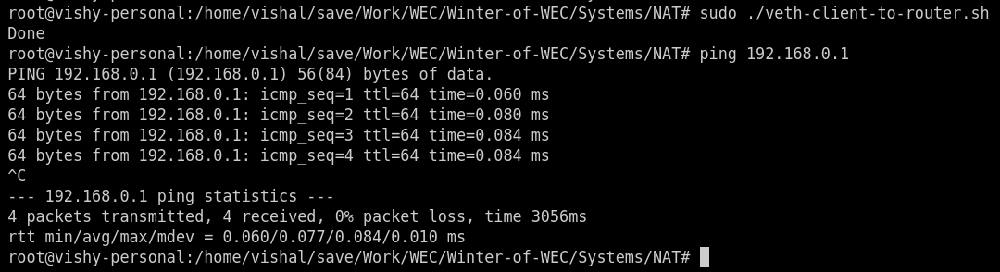
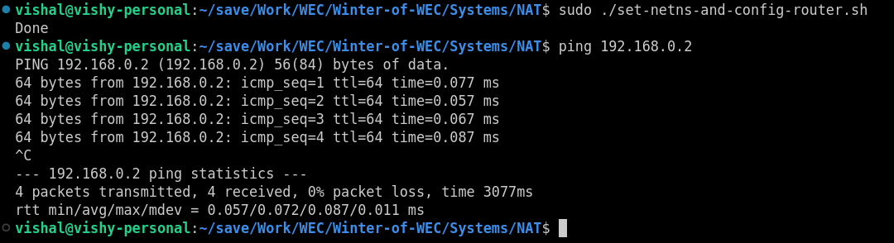
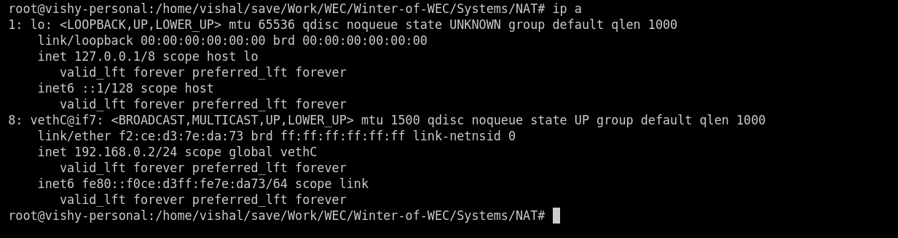
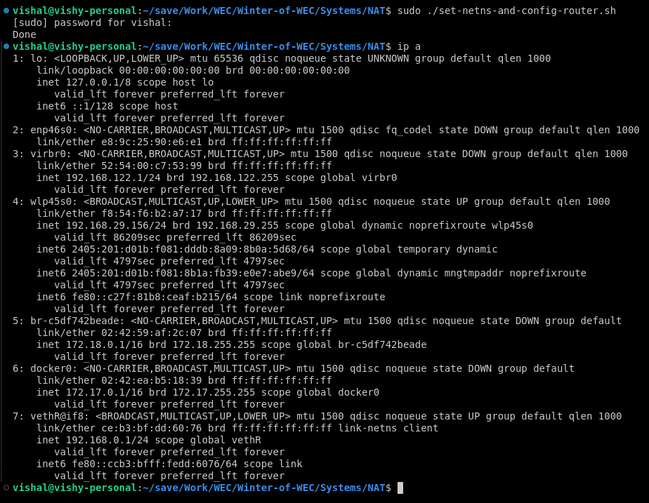

# Networking: Creating a NAT (Network Address Translator) !

This repositories contains my final submissions for the Networking tasks. Have a look at it!

(Note: This is my first time scripting in bash, so not all scripts are self-contained i.e. you may have to run several scripts/commands separately, or run couple of additional commands outside the script. Will try and improve it another time.)

Some instructions:
- Ensure the scripts are excutable, by running: (do this for all the scripts)

    `chmod +x <name-of-the-script>.sh` 

- Most of the commands need root privileges. Please be sure to use it. In addition, the scripts need to be run in a certain order (they build off each other), and need to be run on specfic terminal instances, as mentioned below. Beware!

- I have attempted all the bonuses, have a look!

- Any/all feedback is appreciated :) 

# The Topology

|Client| <--------> |Router (NAT)| <--------> |Internet (Simulated Public Network)|

This simple diagram clearly shows what needs to be done. In order to setup the net topology, I did the following:
- Setup the client/lan using a **linux network namespaces** (One has been setup in the scripts).
- Keep the host (default network namespace) as the lan **edge router** -cum- **firewall**.
- Use the host's WI-FI interface (**wlp45s0**) as its connection to the internet.

# Connecting Client to Router via (V)Ethernet

After adding the client network-namespace using 

`sudo ip netns add client`

I did the following:

- Setup a virtual ethernet cable, and put one end of interface in the client (other is default in host/router).

- Set ip addresses for both interface of the veth, and _bring up_ the interface on both devices.

- Set default gateway on the _client_ as the _router_

To setup the topology, and run the scripts, do the following:

- Make sure you are in the `Winter-of-WEC/Systems/NAT` directory

- Open two terminal windows: one for **router**(host machine - do nothing), and one for **client**(setup will be done below...)

- In **router**, run 
    `sudo ./set-netns-and-config-router.sh`

You should see done, finally.

- Now setup the **client** terminal by running: 

    `sudo ip netns exec client /bin/bash`

- Inside **client** terminal, run 

    `sudo ./veth-client-to-router.sh`

You should see done, finally.

- To test if the **client** and **router** are connected, run 

`ping 192.168.0.2` 

on the **router**, or

`ping 192.168.0.1` 
    
on the **client**. ICMPs should successfully reach and return, as shown.

- However, 
    `ping 1.1.1.1`

,which is a public DNS operated by Cloudflare & APNIC, isn't reachable from **client**. We will enable this in the next step.

- You can run `ip a` on both **client** and **server**, to see something similar to below:

# Masquerading

In order to enable the **client** to access the actual internet (right now, default gateway receives packet, and **router** just drops their packets), we need to enable forwarding on the host, and give it the policy to forward from this subnet. 

In addition, since the client would be an entire subnet and the internet interface is singular (for me, `wlp45s0`), we use **masquerading** to map private ip address at this router (thus, becomes a firewall!). Thus: 

- Setup a `POSTROUTING` masquerade on the NAT table, for the subnet/**client**: 192.168.0.0/24.

- Allow forwarding in the Filter table, between veth and internet interface (wlp45s0).

To set up the masquerading, ensure and execute the following:

- Open the `masquerading.sh` script.

    - Replace all instances of `wlp45s0` with an internet interface on _your_ device.

    - You can find one of these interfaces using the command `ip a`; the list shows the eligible names (search for what they mean :D )
- In the **router** terminal, execute 

    `sudo ./masquerading.sh` 

You should see done, finally.

- To test if the setup has succeeded, execute in the **client** terminal: 
    
    `ping 1.1.1.1`. 

You should see that the ICMPs would have successfully reached and returned.

# Port Forwarding
One of the bonus tasks mentioned was to configure a setup so that hosts from the internet could communicate with our **clientt**, as if it was a web server. The current masquerading setup doesn't expose the subnet (which is good), nor does it handle redirecting any externel connections to the **client**. To fix this, I use the concept of **port forwarding**. In addition, we setup a simple 

- We use port forwarding to pre-route tcp connections on port 80 of the **router** to go to destination of the **client** (now, the new server) - 192.168.0.2:161 .

- Ensure that the various tcp connection types are forwarded properly.

To setup port-forwarding, ensure and execute the following:

- Open the `port-forwarding.sh` script.

    - Replace all instances of `wlp45s0` with an internet interface on _your_ device.

    - You can find one of these interfaces using the command `ip a`; the list shows the eligible names (search for what they mean :D )

- In the **router** terminal, execute 
    
    `sudo ./port-forwarding.sh` 
You should see done, finally.

- To test if the setup has succeeded, execute in the **client** terminal: 
    `python3 server.py` 
    
(you may need to run with root privilege...). You will see the following output:

- To test if you can access the **client** server: 
    
    - Find out the **IP ADDRESS** of the **router** interface that you are using (for me, 192.168.29.156 and wlp45s0).

    - Find out that of another device that connects to the same network as the interface (wlp45s0) connects to.

    - On that device, in a new `bash terminal`, execute: 
    
    `curl http://<IP-of-router>:80/` (for me, `curl http://192.168.29.156:80/`).

    - You should receive a response that says "Hello from Flask, on Vishy's machine!"

# Restrict traffic

As the other bonus task, we had to restrict **outbound** traffic to allow only HTTP and HTTPs connections. I wasn't able to get it to work properly however, but here is my approach:

- Enable http(s) outbound connections using the Filter table, Forward since we are doing this from the router and want to configure for our **client**.

- Restrict all other connections (below the above in the table)

To set this final task up:
- Open the `outbound-restricter.sh` script.

    - Replace all instances of `wlp45s0` with an internet interface on _your_ device.

    - You can find one of these interfaces using the command `ip a`; the list shows the eligible names (search for what they mean :D )

- Run the following script in the **router** terminal: 
    
    `sudo ./out-bound-restricter.sh`. 

You should see a done, finally.

- If successful, the following command should be fine: `curl http://google.com`. But the following shouldn't: `ping 1.1.1.1`. But, doesn't seem like the script has done exactly what I wanted... 

I think those are all of the tasks attempted! :D

# Challenges faced

- The reason I decided to take up this task, was to understand more about the linux network stack, after being pushed by our Professor. In addition, the NIC of my device seems to have been damaged over this past summer, which has motivated me to learn more about what is going on with it. With these tasks, was also able to confirm when my NIC (in fact, all interfaces except LOOPBACK), would essentially all go DOWN.

Some challenges I faced included:

- Exploring through man-pages, which I have understood to be a gem of a resource (at least, the networking ones)
- Understanding iproute2 utilities, along with the different the different tables, chains, and other terminology present. A lot of the commands had different flags, which gave me further insight into some of the quirks of the networking stack.
- Clarifying routing, default gateways, firewalls, and learning the difference between masquerading and port-forwarding. A challenge I still face is identifying scenarios where PREROUTING and POSTROUTING, and other differences like these effect the configuration of the ip tables.

# References

- [Netns Man](https://man7.org/linux/man-pages/man8/ip-netns.8.html)
- [Ip tables Man](https://linux.die.net/man/8/iptables)
- [NAT and Masquerading](https://radagast.ca/linux/nat_and_ip_masquerade.pdf)
- [Scott Lowe's blog](https://blog.scottlowe.org/2013/09/04/introducing-linux-network-namespaces/)
- [Ettore Ciarcia's blog](https://ettoreciarcia.com/publication/02-network-namespaces/)
- [DNAT](http://linux-ip.net/html/nat-dnat.html)
- [Clarifying interface names (everyone always mentioned eth0, which I didn't have...)](https://unix.stackexchange.com/questions/134483/why-is-my-ethernet-interface-called-enp0s10-instead-of-eth0)
- [Iproute2](https://wiki.linuxfoundation.org/networking/iproute2)
